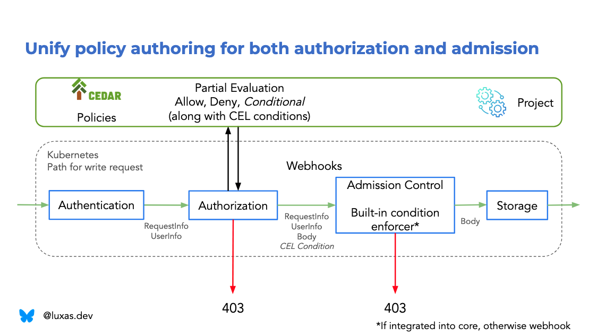

# kubernetes-cedar-authorizer

Proof of concept integrating [Cedar] with [Kubernetes], leveraging in particular
the [Typed Partial Evaluation feature] of Cedar, in order to unify Kubernetes
authorization and admission request stages. The design for this work is found in
my [MSc thesis], please read that work to understand the context. Slides from
the MSc thesis presentation are available [here][thesis-presentation].

This project is intended to be merged into
[Cedar Access Control for Kubernetes] when/if this experiment proves viable. In
addition, this project serves as a temporary playground for experimenting with
how/if Kubernetes could add support for Conditional Authorization, discussed for
example in this [SIG Auth meeting]. Hopefully, a Kubernetes Enhancement Proposal
could be written for the Conditional Authorization, given promising enough
results here and/or later in Cedar Access Control for Kubernetes.

Let Lucas know if you have feedback or ideas.

## Context

By design, Kubernetes authorization operates only on _metadata_, on attributes
that can be inferred from the URL without deserializing the request payload.
This means that Kubernetes authorizers can offer users pretty limited
expressitivity. However, later in the admission stage, more data is available,
for example, the request body and currently stored object in etcd. In order to
write an authorization policy which targets both metadata and data, a user must
use two different paradigms: Kubernetes RBAC and ValidatingAdmissionPolicy (VAP).

Even though the policy author would manage to coordinate the two policy types to
yield a unified result, there are limitations, due to e.g. admission only being
invoked for write requests. In addition, it is hard to understand what the
effective set of access is, if one takes both RBAC and admission into account.

The idea with this project is to experiment with and demonstrate how Kubernetes
authorization and admission could get new capabilities and an improved UX by
integrating with Cedar.

## Motivation

- Allow one uniform user interface across both authorization and admission.
  Allow a policy author to write an authorization policy that only applies if
  some property of the request payload, stored object in etcd, or namespace
  metadata holds. For example,
  - only allow a principal to create `CertificateSigningRequests` with a given
    signer, or
  - only allow a principal to update a resource as long as a sensitive field is
    not changed, or
  - only allow a principal to issue a `ServiceAccount` token with a given
    audience, or
  - only allow a controller to use a specific finalizer.
- Allow limiting the lists and watches to only return resources with certain
  field and label values, using the exact same syntax as for write requests.
  - For example, only allow Gateway/Ingress controllers to list `Secrets` of
    `.type=kubernetes.io/tls` and/or with label `ingress-bindable=true`
  - This is basically a uniform interface for expressing policies using the
    [Authorize with Selectors KEP]
- Allow more expressiveness than RBAC's
  `bound_rule1 || bound_rule2 || ... || bound_ruleN`, where a rule is logically
  `api_group_matches && combinedresource_matches && namespace_matches && name_matches`.
  - Allow binding some data from the user in the condition for what
    kind of resource matches.
  - For example, only allow a node agent to handle resources where
    `.spec.nodeName=<bound-node>`.
  - Allow string matching (principal name, resource name(space)) by prefix or suffix.
  - Absence of prefix matching is discussed in [kubernetes#122154] and
    [kubernetes#56582] (for better and worse, subdiving namespaces is still not
    a good idea).
- Expose the UserInfo `uid` and `extra` fields to the policy author.
- Allow for more fine-grained impersonation. Today, one can only express whether
  a principal can impersonate a given UserInfo attribute independently of all
  other impersonated values. In addition, it is not possible to constrain the
  impersonation to only apply for a given verb or resource.
  - [Constrained Impersonation] is useful e.g. for letting a node agent
    impersonate the node it is running on to get access to a limited set of the
    node's linked resources (e.g. Pods, Secrets, etc.)
  - Combining fine-grained impersonation with string prefix matching allows for
    limiting the permissions of an authenticating front proxy (e.g.
    [kube-oidc-proxy]). Without prefix matching, most likely the RBAC rule
    giving the front proxy ability to impersonate allows impersonating all
    groups, including `system:masters` which gives effectively root cluster
    access, which is most likely not desired.
- Make authoring a policy across authorization and admission stage atomic. In
  other words, make it impossible for e.g. the RBAC (allow) rule to apply when
  the VAP (deny) rule does not (yet).
- Allow restricting the names that can be used when creating an API object
  (including when using `generateName`) [kubernetes#54080]
- Potentially, in the future, allow for writing a limited set of deny rules.

## Goals

- 100% compability with Kubernetes RBAC
- Support any built-in Kubernetes and CRD resource and subresource.
- Fast, bounded policy evaluation time.
- Seamless integration with the Kubernetes API server, and the existing CEL
  infrastructure, by converting from Cedar to CEL where needed.
- Improve the user experience for policy authors, e.g. by instant feedback
  (validation, syntax highlighting, autocompletion, and linting) in the IDE
  (e.g. VS Code)
- Support writing policies simultaneously against multiple API versions of the
  API object, and seamless up- and downgrades.
- Privilege escalation prevention support.
- Allow [mathematical analysis] of the Kubernetes authorization state using SMT
  solvers, based on the [Cedar Symbolic Compiler].
  - This allows e.g. for finding logical inconsistencies in the policies,
    checking if a refactor was done correctly (are the policies before
    mathematically equivalent to the policies after), and more.
- Allow for principal and resource querying, that is, asking for example:
  - "What resources can principal P perform what actions on?"
  - "What principals can perform what actions on resource R?"
  - This is useful for auditing that the end result of all policies combined
    indeed are the desired result.
- Allow increasing expressivity without forcing the cluster administrator to
  build their custom webhook authorizer, which is (understandably) not supported
  in most hosted Kubernetes distributions.
- Don't reinvent the wheel. Use the unique strengths of Cedar and CEL, and the
  vast effort that have gone into SMT solver implementation and research.

## Why Cedar?

Cedar is an authorization engine and policy language that is designed to be
expressive, fast, safe, analyzable. The language has a [formal specification],
and the implementation is [formally verified to conform] to the specification.
[Cedar is open source], Apache 2.0 licensed, and is in the
[process of being donated to the CNCF]. Effectively, Cedar is a stateless
authorization library, written in Rust, and can thus be integrated into almost
any environment. This project utilizes Cedar to solve challenges encountered in
Kubernetes authorization.

See the [Cedar website] for more information. In Lucas' opinion, the best
resource on how Cedar works and is designed in detail, is the
[Cedar OOPSLA paper].

A couple of critical features of Cedar are:

- The [Typed Partial Evaluation feature], which (while only supplying metadata)
  empowers denying such requests, where there is either at least one deny policy
  that is guaranteed to evaluate to true, or all allow policies are guaranteed
  to evaluate to false.
- The [Cedar Symbolic Compiler], which translates Cedar policies into
  mathematical logic, more precisely, [SMT-LIB] format.
- The typed schema, which allows for type-safe policies, and for the policy
  author to reason about the policy in the IDE using the [Cedar IDE plugin].

## Quickstart

Install [kind] v0.29.0 and [kubectl] v1.33.0, e.g. through [Homebrew] on macOS:

```console
$ brew install kind kubectl
...
$ kind version
kind v0.29.0 go1.24.6 darwin/arm64
$ kubectl version               
Client Version: v1.33.4
```

You'll also need `make` and `docker` (or a CLI-compatible alternative, activate
with e.g. `DOCKER=podman make ...`).

Clone Lucas' Kubernetes fork, and checkout the `conditional_authz_2` branch:

```bash
cd .. # Go to the parent directory of this repository
git clone https://github.com/luxas/kubernetes.git
cd kubernetes
git checkout conditional_authz_2
cd ../kubernetes-cedar-authorizer
```

Compile Kubernetes from source:

```bash
kind build node-image /path/to/kubernetes/source --image kindest/node:luxas_conditional_authz_2_latest
```

Note: There is a thousand things that can fail when compiling Kubernetes from
source. For example, if you're on a Mac, you most likely need to install gnu tar
(`brew install gnu-tar`), and set your default shell to bash from homebrew
(`brew install bash`, `sudo ln -s <bash install path> /usr/local/bin/bash`, and
`chpass -s /usr/local/bin/bash`) in order for kubernetes to compile correctly.

Finally, we are ready to build the webhook image and start kind:

```bash
make kind
```

## Conditional Authorization

As part of this experiment, the possibility of returning conditions from the
Kubernetes authorization process, has been explored, and is looking promising.

The following diagram shows how the conditional authorization feature could be
implemented in Kubernetes:



First, Kubernetes authenticates the principal as normal. Then, Kubernetes
invokes the authorizer chain as normal. If the current authorizer
unconditionally allows or denies the request, the process short-circuits, and
either continues or stops. However, an authorizer can now also return a
"conditional" response to Kubernetes, indicating that the request is allowed, as
long as the returned conditions are met. The conditions should only refer to
data that is unavailable at this stage, in other words, the request body (if
any), the stored object (if any), and the namespace metadata (if any). The
conditions are written in CEL, support the `request`, `object`, `oldObject`, and
`namespaceObject` variables, exactly as for ValidatingAdmissionPolicies.

When Kubernetes encounters a conditional response, it will first type-check the
conditions, to make sure the conditions are valid according to the current
OpenAPI schema of the targeted resource. If the conditions are valid, Kubernetes
will attach the conditions to the request's `context.Context`, and continue
processing the request as normally when allowed. However, there is a built-in
admission controller that will verify that any condition attached to the context
are met, and if not, deny the request.

This proof of concept is implemented in Lucas' [conditional_authz_2 Kubernetes branch].

Conditional Authorization is available IFF:

- The SubjectAccessReview (SAR) sender indicates it supports the feature using the
  `kubernetes.io/ConditionalAuthorizationFeature=true` annotation. Conditions
  MUST NOT be returned if this annotation is not set, but instead any
  conditional response that was yielded must be folded into a `NoOpinion`
  response.
  - This allows for backwards-compability with an old SAR sender, but new SAR
    authorizer implementation.
- The SubjectAccessReview/authorizer implementation supports conditions, and
  when needed, responds with the conditions array JSON-encoded in the
  `kubernetes.io/SubjectAccessReviewConditions` annotation, along with
  `.status.allowed=false` and `.status.denied=false`.
  - In case the SAR sender is new, but SAR authorizer implementation old, no
    conditions will ever be returned, but all existing properties about the
    other authorizer are backwards-compatible.
  - Note: When a conditional response is encountered, the authorization process
    is short-circuited, and subsequent authorizers are not consulted. This means
    that even though a "later" authorizer would unconditionally allow the
    request, the request is "only" conditionally authorized.
- The request's GroupVersionResource (GVR) filter selects exactly one GVR, which
  is served by the current API server, and the verb is one of `create`, `update`,
  `patch`, `delete`.
  - The GVR (which might include a subresource) is fully-qualified, means that
    the API server can safely type-check the conditions against the current
    OpenAPI schema of the targeted resource.
- The SubjectAccessReview sender handles enforcement of the conditions whenever
  all the information the conditions target is available, e.g. using a built-in
  admission controller.

## Frequently Asked Questions

### How does this project differ from the [Cedar Access Control for Kubernetes] project?

This project:

- Provides the policy author with a uniform interface for expressing policies.
  In the current Cedar Access Control for Kubernetes, the policy author must
  author policies for authorization and admission separately.
- Allows read and write policies to be authorized in a uniform way.
- Showcases how atomically applicable policies can be written and enforced by
  the Kubernetes core API server (as per Lucas'
  [conditional_authz_2 Kubernetes branch]), instead of by twice by the webhook
  (both at authorization and admission time).
- Is written in Rust; Cedar Access Control for Kubernetes is written in Go.
- Is aimed to be donated and merged into the
  [Cedar Access Control for Kubernetes] project, if this experiment proves
  valuable, and when Cedar is donated to the CNCF.

[Cedar]: https://github.com/cedar-policy/cedar
[Kubernetes]: https://github.com/kubernetes/kubernetes
[MSc thesis]: https://github.com/luxas/research/blob/main/msc_thesis.pdf
[Cedar Access Control for Kubernetes]: github.com/cedar-policy/cedar-access-control-for-k8s
[Typed Partial Evaluation feature]: https://github.com/cedar-policy/rfcs/blob/main/text/0095-type-aware-partial-evaluation.md
[thesis-presentation]: https://speakerdeck.com/luxas/usable-access-control-in-cloud-management-systems
[SIG Auth meeting]: https://youtu.be/Clg-rz9qlUA
[Constrained Impersonation]: https://github.com/kubernetes/enhancements/pull/5285
[kube-oidc-proxy]: github.com/TremoloSecurity/kube-oidc-proxy
[kubernetes#122154]: https://github.com/kubernetes/kubernetes/issues/122154
[kubernetes#56582]: https://github.com/kubernetes/kubernetes/issues/56582
[kubernetes#54080]: https://github.com/kubernetes/kubernetes/issues/54080
[Authorize with Selectors KEP]: https://github.com/kubernetes/enhancements/tree/master/keps/sig-auth/4601-authorize-with-selectors
[mathematical analysis]: https://aws.amazon.com/blogs/opensource/introducing-cedar-analysis-open-source-tools-for-verifying-authorization-policies/
[Cedar Symbolic Compiler]: https://github.com/cedar-policy/cedar/tree/main/cedar-policy-symcc
[Cedar website]: https://www.cedarpolicy.com/en
[formal specification]: https://github.com/cedar-policy/cedar-spec/
[formally verified to conform]: https://aws.amazon.com/blogs/opensource/lean-into-verified-software-development/
[Cedar is open source]: https://github.com/cedar-policy/cedar
[process of being donated to the CNCF]: https://github.com/cncf/sandbox/issues/371
[Cedar OOPSLA paper]: https://www.amazon.science/publications/cedar-a-new-language-for-expressive-fast-safe-and-analyzable-authorization
[SMT-LIB]: https://smt-lib.org/
[Cedar IDE plugin]: https://github.com/cedar-policy/vscode-cedar/
[conditional_authz_2 Kubernetes branch]: https://github.com/luxas/kubernetes/tree/conditional_authz_2
[Homebrew]: https://brew.sh/
[kind]: https://kind.sigs.k8s.io/
[kubectl]: https://kubernetes.io/docs/tasks/tools/#kubectl
