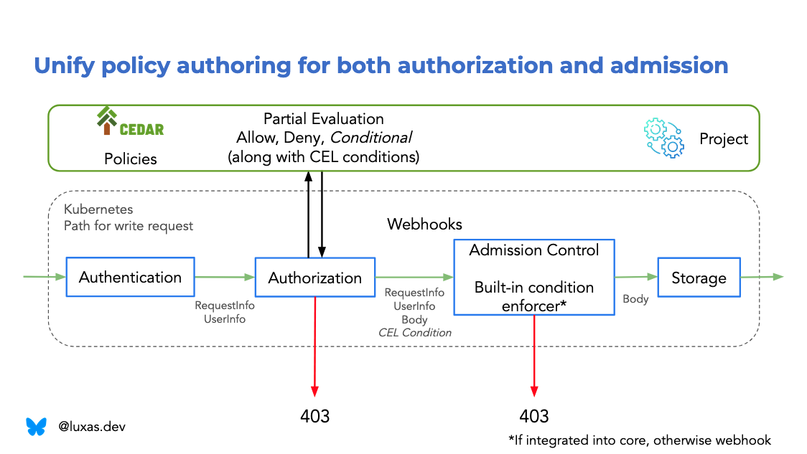

# Getting Started with Kubernetes Cedar Authorizer

This guide walks you through the basic concepts and provides example Cedar
policies with their Kubernetes RBAC equivalents.

## What is Kubernetes Cedar Authorizer?

Kubernetes Cedar Authorizer is an experimental authorization engine that
integrates [Cedar](https://www.cedarpolicy.com/) with Kubernetes, providing a
unified interface for both authorization and admission policies. Unlike
traditional Kubernetes RBAC, Cedar allows you to write expressive policies that
can operate on both the resource metadata and object (both request and storage).

## Key Benefits

- **Unified Policy Language**: Write authorization and admission policies using
  the same unified syntax
- **Object-Aware Authorization**: Give permissions conditionally, based on
  resource content, not just metadata
- **Expressive Conditions**: Support for complex conditions beyond RBAC's limitations
- **Selector Support**: Control how resources can be listed/watched with
  precise label- and field selector filtering
- **Formal Verification**: Policies can be
  [mathematically analyzed](https://aws.amazon.com/blogs/opensource/introducing-cedar-analysis-open-source-tools-for-verifying-authorization-policies/)
  for consistency

## Cedar Policy Structure and Schema

Cedar policies have the following structure:

```cedar
// Policy effect: Can be "permit" or "forbid".
// Forbid policies matched take precedence over permit matches.
permit(
  // Policy header: What types of requests does this policy apply to?
  principal is <type>,
  action in [<action1>, <action2>],
  resource is <type>
) when {
  // Condition that must be true for the policy to apply
} unless {
  // Exceptions when the policy should not apply
};
```

Cedar is a typed authorization language, with rich support for IDE integration,
e.g. autocompletion and validation. This project generates a Cedar schema from
Kubernetes discovery information (what resources are available) and OpenAPI
schema (what do the object payloads look like).

There are four principal types (the type names are referred to as `k8s::User`,
`k8s::Node`, etc. in the policy header):

```cedarschema
namespace k8s {
  // Normal, authenticated Kubernetes users, that are not a Kubernetes
  // ServiceAccount or Node.
  entity User = {
    // UserInfo fields are uniformly present for all authenticated principal types
    "username": String,
    "groups": Set<String>,
    "uid"?: String,               // The ? means that uid is an optional attribute
    "extra": meta::StringToStringSetMap,
  };

  entity ServiceAccount = {
    // UserInfo fields are uniformly present for all authenticated principal types
    "username": String,
    "groups": Set<String>,
    "uid"?: String,
    "extra": meta::StringToStringSetMap,

    // In addition, a ServiceAccount has a name and namespace
    "serviceAccountNamespace": String,
    "serviceAccountName": String,
  };

  entity Node = {
    // UserInfo fields are uniformly present for all authenticated principal types
    "username": String,
    "groups": Set<String>,
    "uid"?: String,
    "extra": meta::StringToStringSetMap,

    // In addition, a Node has a name and namespace
    "nodeName": String
  };

  // An unauthenticated user has no information. In Kubernetes it has the special
  // username "system:anonymous". In order to not grant it permissions by accident,
  // it is represented using a distinct type in Cedar.
  entity UnauthenticatedUser = {};
}
```

Next, there is a set of (autogenerated) resource types. The most generic of them
is `k8s::Resource`, which represents the "base interface" of any possible
Kubernetes resource.

```cedarschema
namespace k8s {
  entity Resource = {
    // Base resource interface attributes
    "apiGroup": String,          // e.g. "" for the core group, or "apps"
    "resourceCombined": String,  // e.g. "deployments" or "pods/scale"
    "namespace": String,         // e.g. "team-1"
    "name": String,              // e.g. "my-deployment"
  };
}
```

Note that `resourceCombined` mirrors how RBAC represents the `resource` and
`subresource` attributes in string format.

However, from Kubernetes discovery information and OpenAPI schema are also
specific resource types generated, e.g. like the two following:

```cedarschema
namespace core {
  entity secrets = {
    // Base resource interface attributes
    "apiGroup": String,          // always ""
    "resourceCombined": String,  // always "secrets"
    "namespace": String,
    "name": String,
    
    // Metadata of the namespace the Secret exists in.
    // Only available in create, update, patch, delete requests
    "namespaceMetadata"?: meta::V1ObjectMeta,
    // The request object payload
    // Only available in create, update, patch requests
    "request"?: core::VersionedSecret,
    // The "old" object in storage, before the request is authorized
    // Only available in list, watch, update, patch, delete, deletecollection requests
    "stored"?: core::VersionedSecret
  };

  // Representation of the secret object, in possibly multiple different API versions.
  type VersionedSecret = {
    "apiVersion": String,        // always "v1"
    "kind": String,              // always "Secret"
    // Metadata is available in create, update, patch, delete requests
    "metadata"?: meta::V1ObjectMeta,
    // The request object, represented using the v1 API version schema.
    // Does not contain the "apiVersion", "kind", and "metadata" fields, as they
    // are part of VersionedSecret already.
    // All fields are available in create, update, patch, delete requests.
    // Field-selectable fields are available in list, watch, deletecollection requests.
    "v1"?: core::V1Secret
  };

  // Secret data, as per the OpenAPI schema
  entity V1Secret = {
    // Field-selectable, can be matched in collection requests.
    @fieldSelectable("true")
    "type": String,
    // Other attributes (e.g. a string-string map), that conditions can be use
    "data"?: meta::StringToStringMap,
    "stringData"?: meta::StringToStringMap,
    "immutable": Bool,
  };
}

namespace apps {
  entity deployments_scale = {
    // Base resource interface attributes
    "apiGroup": String,          // always "apps"
    "resourceCombined": String,  // always "deployments/scale"
    "namespace": String,
    "name": String,
    
    // Metadata of the namespace the Deployment exists in.
    // Only available in update, patch requests
    "namespaceMetadata"?: meta::V1ObjectMeta,
    // The request object payload
    // Only available in update, patch requests
    // Note that as this is a subresource, the payload might not be a Deployment
    // object, but in this case a Scale object.
    "request"?: autoscaling::VersionedScale,
  };
}

namespace autoscaling {
  // Representation of the Scale payload, in possibly multiple different API versions.
  type VersionedScale = {
    "apiVersion": String,        // always "autoscaling/v1"
    "kind": String,              // always "Scale"
    // Metadata is available in update, patch requests
    "metadata"?: meta::V1ObjectMeta,
    // The request object, represented using the v1 API version schema.
    // Does not contain the "apiVersion", "kind", and "metadata" fields, as they
    // are part of VersionedSecret already.
    // All fields are available in update, patch requests.
    "v1"?: core::V1Secret
  };

  type V1Scale = {
    "spec"?: autoscaling::V1ScaleSpec,
    "status"?: autoscaling::V1ScaleStatus
  };

  type V1ScaleSpec = {
    "replicas"?: Long // a Cedar integer
  };

  type V1ScaleStatus = {
    "replicas": Long,
    "selector"?: String
  };
}
```

The API group is `core` for the core `""` Kubernetes API group. Dots in the API
group name are transformed e.g. as follows: `storage.k8s.io` =>
`io::k8s::storage`. The type name is the resource and subresource name combined,
using an `_` instead of a `/`, e.g. like above: `deployments_scale`.

Finally, the schema defines the well-known set of actions that can be performed,
all defined in the `k8s` Cedar namespace:

```cedarschema
namespace k8s {
  action "*" appliesTo {
    principal: [k8s::User, k8s::UnauthenticatedUser, k8s::ServiceAccount, k8s::Node],
    resource: [k8s::Resource, core::secrets, apps::deployments_scale, <and so on...>],
  };

  action "get" appliesTo {
    principal: [k8s::User, k8s::UnauthenticatedUser, k8s::ServiceAccount, k8s::Node],
    resource: [k8s::Resource, core::secrets, <and so on...>],
  };

  action "list" appliesTo {
    principal: [k8s::User, k8s::UnauthenticatedUser, k8s::ServiceAccount, k8s::Node],
    resource: [k8s::Resource, core::secrets, <and so on...>],
  };

  // etc. for all other verbs, e.g. watch, create, update, patch, delete, deletecollection,
  // and impersonate, sign, approve, etc. and any custom verbs that the user is using
}
```

Note that not all actions apply to all resources, e.g. `apps::deployment_scale`
can only be updated or patched. Thanks to Cedar's typed schema, the policy
validator will immediately notify the policy author, if they write an invalid
policy, e.g. authorizing the action `list` for `apps::deployment_scale`, which
makes no sense. This feedback loop and tight validation helps the policy author
actually get the policies they write closer to their intent.

## Expressing Kubernetes RBAC rules using Cedar

First and foremost, the Cedar policies expressed do not (currently) distinguish
between roles and bindings. This layer of indirection could be added in the
future, but the current method is to match both the binding subjects and the
resource authorizations in one policy. This will most likely become easier as
well as [Cedar generalize their templates](https://github.com/cedar-policy/rfcs/pull/98).

### Allowing two subjects to get, list, and watch pods and deployments

```yaml
apiVersion: rbac.authorization.k8s.io/v1
kind: ClusterRoleBinding
metadata:
  name: clusterwide-basic-readers
subjects:
- kind: User
  name: alice
- kind: User
  name: bob
roleRef:
  kind: ClusterRole
  name: basic-reader
---
apiVersion: rbac.authorization.k8s.io/v1
kind: ClusterRole
metadata:
  name: basic-reader
rules:
- apiGroups: [""]
  resources: ["pods"]
  verbs: ["get", "list", "watch"]
- apiGroups: ["apps"]
  resources: ["deployments"]
  verbs: ["get", "list", "watch"]
```

```cedar
permit(
  principal is k8s::User,
  action in [k8s::Action::"get", k8s::Action::"list", k8s::Action::"watch"],
  // No "is" here means that any resource type is matched
  // Make sure to restrict resource.apiGroup and resource.resourceCombined to
  // avoid matching any resource type in the cluster!
  resource 
) when {
  // The subjects/principals must match
  ["alice", "bob"].contains(principal.username) &&
  // The resource must match. Note that any namespace and name matches.
  (
    (resource.apiGroup == "" && resource.resourceCombined == "pods") ||
    (resource.apiGroup == "apps" && resource.resourceCombined == "deployments")
  )
};
```

Another (more concise) way to match a specific combination of apiGroup/resource
would be to make use of the Cedar types like follows:

```cedar
permit(
  principal is k8s::User,
  action in [k8s::Action::"get", k8s::Action::"list", k8s::Action::"watch"],
  // No "is" here means that any resource type is matched
  // Make sure to restrict resource.apiGroup and resource.resourceCombined to
  // avoid matching any resource type in the cluster!
  resource 
) when {
  // The subjects/principals must match
  ["alice", "bob"].contains(principal.username) &&
  // The resource must match. Note that any namespace and name matches.
  (resource is core::pods || resource is apps::deployments)
};
```

`resource is core::pods` if and only if
`resource.apiGroup == "" && resource.resourceCombined == "pods"`, and thus they
can be used interchangeably. However, as we will see later in the conditional
authorization section, `is` usage is preferred, as it lets Cedar know the
specific attributes that can be accessed, and their types, respectively. This
allows expressing conditions against e.g. the request object.

### Expressing wildcards and the `cluster-admin` Role

Recall that all basic resource fields (`apiGroup`, `resourceCombined`,
`namespace` (if any), and `name`) are required. What happens in case of e.g.
`kubectl get pods`, where any name matches the request? Kubernetes RBAC encodes
this using special string values (`"*"` for apiGroup and resource, but `""` for
namespace and name). Thus, could one think that the Cedar expression
`resource.apiGroup == "*"` or `resource.name == ""` would match resources in any
API group, or with any name. This is, importantly, **not** the case, due to that
this project (and Cedar) is using mathematical logic to compare policies. The
expression `resource.apiGroup == "*"` will always result in the request getting
denied.

If a policy author wants a `permit` or `forbid` policy to match "any value" of
some attribute, the solution is simple: don't write any condition at all!

To illustrate this concretely, here is a simplified version of the "root" user
privileges in Kubernetes:

```yaml
apiVersion: rbac.authorization.k8s.io/v1
kind: ClusterRoleBinding
metadata:
  name: cluster-admin
subjects:
- kind: Group
  name: system:masters
roleRef:
  kind: ClusterRole
  name: cluster-admin
---
apiVersion: rbac.authorization.k8s.io/v1
kind: ClusterRole
metadata:
  name: cluster-admin
  # any namespace is matched thanks to it being a ClusterRole
rules:
- apiGroups: ["*"]
  resources: ["*"]
  verbs: ["*"]
  # any name is matched thanks to resourceNames being omitted
```

In Cedar, this would be expressed as:

```cedar
permit(
    principal is k8s::User,
    action in [k8s::Action::"*"],
    resource // any resource matched
) when { principal.groups.contains("system:masters") };
// no other restrictions on the resource
```

This expression evaluates to true for any resource in the system, as there are
no conditions that restrict the `resource` variable!

### Scoping authorizations to a given namespace

What if you don't want to give cluster-wide access, but limit the a principal's
access to only a set of namespaces, e.g. as you'd use `RoleBinding`s? Just
restrict the `resource.namespace` variable, e.g. through the following example:

```yaml
# The engineers group can do any namespaced operation in the dev and staging namespaces
apiVersion: rbac.authorization.k8s.io/v1
kind: RoleBinding
metadata:
  name: namespace-admins
  namespace: dev
subjects:
- kind: Group
  name: engineers
roleRef:
  kind: ClusterRole
  name: cluster-admin
---
apiVersion: rbac.authorization.k8s.io/v1
kind: RoleBinding
metadata:
  name: namespace-admins
  namespace: staging
subjects:
- kind: Group
  name: engineers
roleRef:
  kind: ClusterRole
  name: cluster-admin
```

The equivalent in Cedar would be:

```cedar
permit(
    principal is k8s::User,
    action in [k8s::Action::"*"],
    resource
) when {
  principal.groups.contains("engineers") &&
  resource has namespace &&
  ["dev", "staging"].contains(resource.namespace)
  // Or, one could also write the above as two separate ORed equals statements:
  // (resource.namespace == "dev" || resource.namespace == "staging")
};
```

### Authorizing access to subresources

Say you have an autoscaling controller that should be able to scale anything
within the cluster:

```cedar
permit(
    principal is k8s::ServiceAccount,
    action in [k8s::Action::"update", k8s::Action::"patch"],
    resource
) when {
  // serviceAccountName(space) available thanks to "is k8s::ServiceAccount" above
  principal.serviceAccountName == "my-autoscaler" &&
  principal.serviceAccountNamespace == "my-autoscaler-ns" &&
  // Cedar's "like" performs a wildcard match
  resource.resourceCombined like "*/scale"
  // Note: apiGroup, namespace and name are all unrestricted here
};
```

Important: Just like how `resource.apiGroup == "*"` is an invalid expression
which always makes the policy be skipped, so is e.g.
`resource.resourceCombined == "*/scale"`, again for analyzability reasons. The
`like` operator must be used for matching wildcards.

One gotcha with Kubernetes authorization today is that "connectable"
subresources are authorized using various authorization verbs, which depend on
the transport, and not the logical operation. For example, giving the power for
someone to
[execute `pods/exec` can be done in Kubernetes RBAC through the `get`](https://github.com/kubernetes/kubernetes/issues/133515)
permission, as the client indeed uses a HTTP GET request together with a
WebSocket in order to carry out the request. In the admission stage though, the
API server does not communicate the authorization verbs, but advertises the
operation as a `CONNECT` operation.

This means that a policy author could _believe_ that the following RBAC rule only
gives read-only access:

```yaml
apiVersion: rbac.authorization.k8s.io/v1
kind: RoleBinding
metadata:
  name: readonly
  namespace: team-1
subjects:
- kind: User
  name: alice
roleRef:
  kind: Role
  name: readonly
  namespace: team-1
---
apiVersion: rbac.authorization.k8s.io/v1
kind: Role
metadata:
  name: readonly
  namespace: team-1
rules:
- apiGroups: ["*"]
  resources: ["*"]
  verbs: ["get", "list", "watch"]
```

Where in fact it gives `alice` the power to execute any command in any Pod (in
the namespace), get Pods' logs, port forward network traffic to the Pods,
something that most likely was not intended. In order to make the `get` action
really mean "read metadata" in this project, connectable subresources
`core::pods_exec` cannot be bound to the `k8s::Action::"get"` action. In fact,
Cedar will already during validation time in the IDE throw an error with this
information:


This means that the following Cedar policy actually gives Alice read-only access
in the `team-1` namespace:

```cedar
permit(
    principal is k8s::User,
    action in [k8s::Action::"get", k8s::Action::"list", k8s::Action::"watch"],
    resource
) when {
  principal.username == "alice" &&
  resource has namespace &&
  resource.namespace == "team-1"
};
```

Whereas the following policy gives connect access (and Cedar's language server
shows the applicable resource types for the `connect` action):


TODO: Unauthenticated principals

## Going beyond Kubernetes RBAC: Through Cedar's expressiveness

So far, we've demonstrated Cedar policies that have a Kubernetes RBAC
equivalent. Next, we'll proceed into policy types that are not natively
supported by RBAC, or hard to achieve.

We'll group the new features/expressiveness into four buckets:

1. (This section) New expressiveness unlocked "just" by using a general-purpose
  authorization language, without changing Kubernetes.
1. How Kubernetes could be extended to support uniformly writing policies across
  authorization and admission. This is the base for the Conditional
  Authorization KEP to be written as a result of this PoC.
1. How the Conditional Authorization KEP to be written as part of this project
  actually can reimplement, and extend the features and functionality of the
  [Constrained Impersonation KEP](https://github.com/kubernetes/enhancements/tree/master/keps/sig-auth/5284-constrained-impersonation).
1. What a uniform user experience for the already-implemented
  [Authorize with Selectors KEP](https://github.com/kubernetes/enhancements/tree/master/keps/sig-auth/4601-authorize-with-selectors)
  could look like.

### Using principal UID or "extra" information

In Kubernetes RBAC, the two fields that can be used when matching subjects is
username and groups. Here, also the principal UID (if available), and userinfo
extra is available.

[Structured Authentication Configuration](https://kubernetes.io/docs/reference/access-authn-authz/authentication/#using-authentication-configuration)
is a handy way to make the Kubernetes API server trust OIDC issuers. Using CEL
expressions, one can map arbitrary JWT claims into the userinfo extra. For
example, it might be useful to know in authorization whether an admin was
authenticated using Multi-Factor Authentication (MFA), and require use of MFA
when deleting sensitive resources as follows:

```cedar
permit(
    principal is k8s::User,
    action in [k8s::Action::"delete"],
    resource // The admin can delete any resource...
) when {
  principal.groups.contains("admin") &&
  // ...but only if the admin has the namespace name as a group, and...
  resource has namespace &&
  principal.groups.contains(resource.namespace) &&
  // if MFA was enabled during authentication
  principal.extra.hasTag("mfa-authenticated") &&
  principal.extra.getTag("mfa-authenticated") == ["true"]
};
```

Why is there both `hasTag` and `getTag`? Due to Cedar's type-safe nature, one
must always check whether optional values (like Rust's `Option<T>`) have a
value, before trying to use the value. In other words, there is no `null` such
that when accessed, throws an exception (like some programming languages).

Why `principal.extra.getTag("mfa-authenticated") == ["true"]` and not
`principal.extra.getTag("mfa-authenticated") == "true"`? The reason is that
Kubernetes' UserInfo extra is modelled similar to HTTP headers, where each key
can have multiple values. In this case, it's most likely reasonable to expect
there only to be one element, and force it to be true encoded as a string.
However, this of course heavily depends on the authenticator configuration, so
this example is not "portable" across clusters, in the same way as user and
group names aren't either.

### Using principal data for restricting authorized resources

Imagine a case where a node agent would need to get some information about the
`Node` object that it's running on. Indeed, it would be easy to give the
ServiceAccount of the node agent `get "" nodes` privileges cluster-wide (and
this what people are doing today). However, the Kubernetes ServiceAccount JWT
issuer binds the ServiceAccount JWT token to the Pod and Node it's running
in/on, and the corresponding authenticator exposes that data in the userinfo
extra.

This fact makes it possible to write a more fine-grained policy, that restricts
the node name to each agent's node, like follows:

```cedar
permit(
    principal is k8s::ServiceAccount,
    action == k8s::Action::"get",
    resource is core::nodes
) when {
  principal.serviceAccountName == "my-node-agent" &&
  principal.serviceAccountNamespace == "my-node-agent-ns" &&
  // if MFA was enabled during authentication
  principal.extra.hasTag("authentication.kubernetes.io/node-name") &&
  principal.extra.getTag("authentication.kubernetes.io/node-name") == [resource.name]
};
```

The Kubernetes RBAC model allows bindings to only express conditions using the
principal username, groups, and the resource namespace. Roles can only express
conditions using the action and resource information. However, sometimes it's
useful to make use of the both the principal and resource information at the
same time, and Cedar empowers the policy author to do this.

### ANDed principal constraints

Sometimes, one would like that the principal must belong to two groups in order
to be able to acquire a given privilege.

For example, imagine the authentication system authenticates users by adding the
`team-X` group to the principal, and also an `oncall` group, if the principal is
on-call. In this case, it is reasonable to assume that

1. the teams should be isolated into their own namespaces, and
2. only some privileges should be activated for those on-call, within their
   boundary.

One obvious solution to this, is to make a composite group in the authentication
system, of form `team-X-oncall`, and assign the extra privileges needed when
being on-call in that team. This the solution when using Kubernetes RBAC.
However, this is not always possible (due to how the authentication system is
designed), and also building and matching against such a string easily becomes
complicated (especially if
[escaping is needed](https://speakerdeck.com/thockin/how-to-convert-strings-and-how-not-to-aka-escaping-is-harder-than-it-seems)).

As Cedar allows for arbitrary ANDed and ORed expressions, the solution is straightforward:

```cedar
// Allow oncall users to delete (i.e. re-create stuck) pods in their authorized namespace
permit(
    principal is k8s::User,
    action in [k8s::Action::"delete"],
    resource is core::pods
) when {
  resource has namespace &&
  principal.groups.contains(resource.namespace) &&
  principal.groups.contains("oncall")
};
```

### Prefix matching

Matching some value against a prefix has been a request for a long time.
Kubernetes RBAC does not per se support wildcards, but special wildcard-like
values have made their way into some core Kubernetes components, resulting in
confusion with regards to privilege escalation checks.

Indeed, subdividing a namespace, which forms the canonical trust domain in
Kubernetes, is not a good idea. Use-cases where one would like to use name
prefix matching in order to, e.g. allow a certain principal to list all Pods
that are spawned by a certain Deployment by matching the Pod's name by the
Deployment prefix, should not be encouraged. One of the reasons for this is that
it's a very soft boundary. Say that principal `bob` can list all Pods with
`resource.name like "backend-api-*"`. This works great, until there is another
Deployment called `backend-api-vault`, which generates Pods with a name `bob`
can see, although they shouldn't. It can be noted, that prefix and suffix
matches are already available in `ValidatingAdmissionPolicies` for write requests.

To mitigate abuse of the prefix matching feature in that way,
`resource.name like <string>` could be disallowed in validation, with a link to
documentation on why this (probably) is a bad idea, but still let the policy
author suppress the warning with a Cedar policy annotation, e.g.
`@allow("prefix-match=name")`, just like how programming language linters
usually work.

However, Cedar's `like` operator is very handy when matching
`resource.resourceCombined`, like we saw before, and also for example for
authorizing impersonation requests.

[kube-oidc-proxy](github.com/TremoloSecurity/kube-oidc-proxy) is an example
component that needs to be able to impersonate, say, usernames and groups, in
order to authenticate principals to Kubernetes that otherwise couldn't. However,
unless the list of principals authenticating through the proxy is statically
known, it's not possible to enumerate every username and group the proxy should
be able to impersonate. Thus must the proxy be able to impersonate _any_
username and group, including the "root" group in Kubernetes, `system:masters`.
If the proxy credentials were leaked, those credentials can do anything in the
cluster, just by adding the `Impersonate-Group: system:masters` header. This is
not desired.

In addition, if the proxy sources the groups from some identity provider like
Keycloak, a "smart" user could figure out to add themselves to the
`system:masters` Keycloak group (as that probably means nothing on the Keycloak
side, and thus is not prevented), thus getting full cluster access. To avoid
this, the proxy should prefix all usernames, groups, and extra information with
some unique prefix, and the proxy's `impersonate` privilege in Kubernetes should
be restricted to only allow strings with that prefix.

The following policy would allow the proxy to impersonate only usernames with
the prefix `oidc:`

```cedar
permit (
    principal is k8s::User,
    action in [k8s::Action::"impersonate"],
    resource is io::k8s::authentication::users
) when {
    principal.username == "oidc-front-proxy" &&
    resource.name like "oidc:*"
};
```

The same technique works for groups, uids, and userinfo extras as well, as the
Kubernetes sends one `SubjectAccessReview` request per such impersonation request.

## Going beyond Kubernetes RBAC: Through Conditionally-authorized writes

### Background

As Kubernetes authorization only operates on metadata, but Kubernetes admission
also has knowledge of the request and stored objects, a policy author can get
into a situation where they "over-grant" in the authorization stage, only to
"right-size" the permissions in the admission stage.


Some of the use-cases can already be practically solved through writing RBAC +
[`ValidatingAdmissionPolicy`](https://kubernetes.io/docs/reference/access-authn-authz/validating-admission-policy/)
(VAP) objects; e.g. like the example in the picture of giving principal `lucas`
access to only write gateways with of class `test-gateway` (and not for example
the production one!). However, the policy author needs to:

- understand two different paradigms (RBAC and VAP).
- take care to always create the VAP (deny) rule first, and only after that
  create the RBAC (allow) rule; otherwise one might end up in a state where
  `lucas` indeed could write a gateway of any class (e.g. in case some apply
  operation was cancelled half-way due to an error).
- (most likely) have permissions to not only create RBAC rules (which support
  [privilege escalate prevention](https://kubernetes.io/docs/reference/access-authn-authz/rbac/#privilege-escalation-prevention-and-bootstrapping),
  and have namespaced `Role` and `RoleBinding` variants), but also
  `ValidatingAdmissionPolicy` and `ValidatingAdmissionPolicyBinding` objects,
  which only have cluster-wide variants, and do not support privilege escalation
  prevention.
  - In other words, someone with `create validatingadmissionpolicy{,binding}`
    privileges can make the cluster effectively read-only by writing a
    validation rule for any resource and write operation using a static
    validation expression that is just `false`. Even the cluster admin gets
    locked out of writing anything, until they remove the offending VAP object.
    Thus, is VAP a very powerful tool, that should be used with utmost care.
  - Luckily, there are ways to avoid the above problem, by using namespaced VAP
    parameter objects, that a namespaced administrator can use to configure,
    e.g. what gateway classes are writable by principals in that context.

Another way to solve this use-case, in (hopefully) a bit more declarative,
intent-driven, and authorization-focused way, is through conditional
authorization. At the highest level, conditional authorization allows
authorizers to express policies that restrict the values of both metadata (like
RBAC) _and_ request data (like VAP), for example: "allow lucas to create
gateways, but only if the class name is 'test-gateway'".

Indeed, the request object is not available at the authorization stage, but as
long as the authorizer concludes that:

1. The request is not unconditionally denied, using only the metadata
   information available now, and
2. The request could become allowed, if some certain conditions on the (right
   now unknown) request or stored object hold,

then it is okay to continue the request chain, decode the request object, and
perform mutating admission. Then, when the request gets to the validating
admission stage, it is time to enforce the conditions. Now, with the complete
data available that the authorization policies were written against, it is
possible to compute a definite response (Allowed/Denied), and deny the request
if the response was negative.

The following diagram shows how the conditional authorization feature could be
implemented in Kubernetes:



The `SubjectAccessReview` (SAR) API between the Kubernetes API server and any
configured authorizer would be extended to return a set of conditions, in the
case that the authorizer concluded that the request is neither unconditionally
allowed nor denied. In other words, if the SAR `.status.allowed == false` and
`.status.denied == false`, future versions of the Kubernetes API server could
also take the `.status.authorizationConditions` (naming TBD) list into account.

If the API server concludes that the chain of authorizers did neither
unconditionally allow nor deny the request as-is, then the API server continues
with the request chain (as if the request were allowed), and propagates the
conditions to the validating admission stage. If the request made its way
through to validating admission, then there is a built-in admission controller
that enforces the conditions.

Currently, the proposal is that Kubernetes would re-use its existing CEL
framework as the method of expressing these conditions, effectively the same
environment as ValidatingAdmissionPolicies use. This is not a problem for Cedar
though, as Cedar policies can be transformed into (more or less) equivalent CEL
ones.

Conditional authorization would be available when all of the following criterias
are met:

- The API server indicates it supports the feature using the
  `kubernetes.io/ConditionalAuthorizationFeature=true` annotation. Conditions
  MUST NOT be returned if this annotation is not set, but instead any
  conditional response that was yielded must be folded into a `NoOpinion`
  response.
  - This allows for backwards-compability with an old API server, but new
    authorizer implementation.
- The authorizer implementation supports conditions, and
  when needed, responds with the conditions array, along with
  `.status.allowed=false` and `.status.denied=false`.
  - In case the API server is new, but authorizer implementation old, no
    conditions will ever be returned, but all existing properties about the
    other authorizer are backwards-compatible.
- The SubjectAccessReview's `apiGroup`, `resource` and `apiVersion` selects
  exactly one GVR, which is served by the current API server, and the verb is
  one of `create`, `update`, `patch`, `delete`, `connect` or `conditionalimpersonate`.
- The API server's built-in admission controller for enforcing the conditions is
  activated.

### Only allowing usage of a certain class

In the example above, only usage of a certain "class", no matter if it's for a
load balancer/gateway, persistent volume, service, or similar might be useful,
especially when the shared resource (class) is cluster-scoped, but the referring
principal and object is namespace-scoped.

Building upon the previous example, here is how to give engineers within the
group with the namespace name access to create, update, and delete persistent
volumes, but only slow ones for development, which are cheaper.

```cedar
permit(
  principal is k8s::User,
  action in [
    k8s::Action::"create",
    k8s::Action::"patch",
    k8s::Action::"update",
    k8s::Action::"delete"],
  resource is core::persistentvolumeclaims
) when {
  principal.groups.contains("engineers") &&
  principal.groups.contains(resource.namespace) &&
  (if resource has request then
    resource.request has v1.spec.storageClassName &&
    resource.request.v1.spec.storageClassName == "development"
  else true) &&
  (if resource has stored then
    resource.stored has v1.spec.storageClassName &&
    resource.stored.v1.spec.storageClassName == "development"
  else true)
};
```

In this example, only one policy is used, instead of separate ones for create
(which only has a request object), update/patch (which have both a request and
stored object), and delete (which only has a stored object), but one could also
create three individual policies, if one wants to avoid the `if` statement. Even
though in theory the storageClassName could also be left unset, this example
policy forces it to be set to development.

Let's follow what will happen when this policy is evaluated. Consider this `SubjectAccessReview`:

```yaml
apiVersion: authorization.k8s.io/v1
kind: SubjectAccessReview
spec:
  user: charlie
  groups:
  - engineers
  - team-1
  - team-2
  resourceAttributes:
    verb: update
    group: ""
    version: v1
    resource: persistentvolumeclaims
    namespace: team-1
    name: test-data
```

Cedar will _partially evaluate_ the policies in the light of this request
metadata from the `SubjectAccessReview`. In this case, the new and old objects,
represented as `resource.request.v1` and `resource.stored.v1` respectively are
_unknown_. However, all data that is known (from the `SubjectAccessReview`) is
simplified, yielding the following expression:

```cedar
resource.request.v1 has spec &&
resource.request.v1.spec has storageClassName &&
resource.request.v1.spec.storageClassName == "development" &&
resource.stored.v1 has spec &&
resource.stored.v1.spec has storageClassName &&
resource.stored.v1.spec.storageClassName == "development"
```

Note that because it was an `update` operation, it was known that
`resource has request` == true, and `resource has stored` == true, and thus
could the if statement be simplified. For clarity, the `has` syntax is fully
expanded here, showing every part of the evaluation separately. When this
expression is translated into CEL, for enforcement in the API server, it
becomes:

```cel
has(object.spec) &&
has(object.spec.storageClassName) &&
object.spec.storageClassName == "development" && 
has(oldObject.spec) &&
has(oldObject.spec.storageClassName) &&
oldObject.spec.storageClassName == "development"
```

If the same principal `charlie` would execute the same request (e.g.
`kubectl edit persistentvolumeclaims test-data`), but against the `team-3`
namespace, Cedar would evaluate the policy to a static `false`, as
`principal.groups.contains(resource.namespace)`, or during the evaluation with
the concrete data `["engineers", "team-1", "team-2"].contains("team-3")` is
`false`, and thus evaluation short-circuits. Thus is there no significant
Denial-of-Service risk of unauthorized requests being able to make the API
server do a lot of decoding work of large payloads. If there is no path towards
becoming authorized later, the request is rejected early in the API server,
before any decoding, just like before this feature introduction.

### Restricting a subresource write

Recall the `apps::deployments_scale` subresource type from the schema in the
beginning. The request object for this subresource is of kind
`autoscaling/v1 Scale`. The earlier example autoscaling authorization policy let
the ServiceAccount `my-autoscaler-ns:my-autoscaler` `update` and `patch` scale
any resource. However, if one wants to only conditionally authorize the
operation using data from the request object (e.g. in this case, `Scale`), one
needs to first tell Cedar what the resource type `is`, like follows:

```cedar
permit(
    principal is k8s::ServiceAccount,
    action in [k8s::Action::"update", k8s::Action::"patch"],
    resource is apps::deployments_scale
) when {
  principal.serviceAccountName == "my-autoscaler" &&
  principal.serviceAccountNamespace == "my-autoscaler-ns" &&
  // Only allow autoscaling up to 50 replicas; don't let the autoscaler go crazy
  resource has request.v1.spec.replicas &&
  resource.request.v1.spec.replicas <= 50
};
```

The CEL expression communicated to the API server for the enforcement would be:

```cel
has(object.spec) && has(object.spec.replicas) && object.spec.replicas <= 50
```

### Restricting a connect request

Before
[KEP-2862: Fine-grained Kubelet API Authorization](https://github.com/kubernetes/enhancements/blob/master/keps/sig-node/2862-fine-grained-kubelet-authz/README.md),
monitoring agents that wanted to scrape the kubelet's `/pods` endpoint by going
through the API server proxy needed permission to `create "" nodes/proxy`. That
worked without problems, but made it possible for such a monitoring agent to
also execute into pods on the node, by crafting a request against the
`/exec/...` endpoint of the kubelet, instead of the intended and read-only
`/pods/...` endpoint.

The linked KEP now introduces a special-cased `nodes/pods` subresource to allow
for right-sizing the permissions of the monitoring agent, that indeed only
requires read-only access. However, this could be done with this project in the
following way:

```cedar
permit(
    principal is k8s::ServiceAccount,
    action == k8s::Action::"connect",
    resource is core::nodes_proxy
) when {
  principal.serviceAccountName == "monitoring-agent" &&
  principal.serviceAccountNamespace == "monitoring-agent-ns" &&
  resource has request.v1 &&
  resource.request.v1.path like "/pods/*" // and/or any other paths needed
};
```

The CEL request to be enforced in admission would be:

```cel
request.options.path.startsWith("/pods/")
```

### Restricting a name on a create

One consequence of the request body not being decoded at the time of
authorization, is that the name of the object in a `create` request is not known
at that point. In Kubernetes RBAC, this leads to that one must authorize the
requesting principal to create an object of the resource type with any name
([kubernetes#54080](https://github.com/kubernetes/kubernetes/issues/54080)).

Say that your component stores some data in a `Secret` with name
`foo-controller` in the `kube-system` namespace. Only access to that specific
Secret is required, and as per the least privilege principle, the policy author
writes the following `Role` and binds it to `foo-controller`.

```yaml
apiVersion: rbac.authorization.k8s.io/v1
kind: ClusterRole
metadata:
  name: read-secret-foo-controller
  namespace: kube-system
rules:
- apiGroups: [""]
  resources: ["secrets"]
  verbs: ["get", "create", "update", "patch", "delete"]
  resourceName: ["foo-controller"]
```

Yet, due to the above anomaly, this does not work (contrary to what you'd
expect); the policy author needs to modify the RBAC rule as follows:

```yaml
apiVersion: rbac.authorization.k8s.io/v1
kind: ClusterRole
metadata:
  name: read-secret-foo-controller
  namespace: kube-system
rules:
- apiGroups: [""]
  resources: ["secrets"]
  verbs: ["create"]
  # can create any resourceName
- apiGroups: [""]
  resources: ["secrets"]
  verbs: ["get", "update", "patch", "delete"]
  resourceName: ["foo-controller"]
```

Expressing the same policy using this project works as expected:

```cedar
permit(
  principal is k8s::ServiceAccount,
  action in [
    k8s::Action::"get",
    k8s::Action::"create",
    k8s::Action::"update",
    k8s::Action::"patch",
    k8s::Action::"delete"],
  resource is core::secrets
) when {
  principal.serviceAccountName == "foo-controller" &&
  principal.serviceAccountNamespace == "kube-system" &&
  resource.namespace == "kube-system" &&
  resource.name == "foo-controller"
};
```

How is this possible? The trick is, again, to use partial evaluation.
`resource.name` is known for verbs `get`, `update`, `patch`, and `delete`, but
for `create` it is indeed unknown, yielding the Cedar residual:

```cedar
resource.name == "foo-controller"
```

which is translated into CEL as:

```cel
request.name == "foo-controller"
```

### Utilizing namespace metadata for write requests

The Kubernetes `ValidatingAdmissionPolicy` API exposes information about the
namespace object for namespaced requests. Thus, can also the Cedar policies
(which turn into VAP-like expressions later in the request chain) be used for
computing an authorization decision.

The
[DRA AdminAccess](https://github.com/kubernetes/enhancements/tree/master/keps/sig-auth/5018-dra-adminaccess)
KEP uses a mechanism like that; it only allows creating especially powerful
`ResourceClaim`s in namespaces with the
`resource.kubernetes.io/admin-access=true` label.

Unfortunately for this specific case, the `adminAccess` property is nested
within a `requests` slice, and Cedar
[does not support loops](https://github.com/upbound/kubernetes-cedar-authorizer/issues/45)
(at the moment at least). However, pseudo-code for expressing that policy in
Cedar would be:

```cedar
forbid(
  principal,
  action in [k8s::Action::"create", k8s::Action::"update", k8s::Action::"patch"],
  resource is io::k8s::resource::resourceclaims // and templates
) when {
  // Disallow enabling adminAccess, unless the namespace has the right label
  // The real field is .spec.devices.requests[*].adminAccess, but if we imagine it
  // would just have been .spec.devices.allowAdminAccess; it'd be expressed as:
  resource has request.v1 &&
  resource.request.v1.spec.devices.allowAdminAccess
} unless {
  resource has namespaceMetadata.labels &&
  resource.namespaceMetadata.labels.hasTag("resource.kubernetes.io/admin-access") &&
  resource.namespaceMetadata.labels.getTag("resource.kubernetes.io/admin-access") == "true"
};
```

Indeed, there are other use-cases for using namespace information than this
example. The CEL expression (for the _forbid policy_, which denies the requests
if the condition evaluates to `true`) generated would be something like:

```cel
object.spec.devices.allowAdminAccess &&
!(namespaceObject != null && 
  has(namespaceObject.labels) && 
  has(namespaceObject.labels["resource.kubernetes.io/admin-access"]) && 
  namespaceObject.labels["resource.kubernetes.io/admin-access"] == "true")
```

Sidenote: Cedar supports both `permit` and `forbid` policies, but this guide has
not covered the `forbid` policies in any greater extent yet, as this project
still needs to decide on whether to choose to support them, and if so, enable a
consistent
[privilege escalation framework](https://github.com/upbound/kubernetes-cedar-authorizer/issues/3)
for the forbid policies.

TODO: Conditional authorization vs compound authorization

## Going beyond Kubernetes RBAC: Constraining Impersonation

- Only impersonating a group when a given username is impersonated
- Only being able to perform some requests during impersonation

## Going beyond Kubernetes RBAC: Through label and field selectors for reads

- Filtering out a namespace or name in a watch (e.g. "not kube-system")
- Conditional authorization for reads using selectors

## TODO

- Multi-version conditional authorization for writes
- Non-resource requests
- Aggregated clusterroles?

Limitations:

- No field selector on get
- Only some fields selectable
- No loops in Cedar
